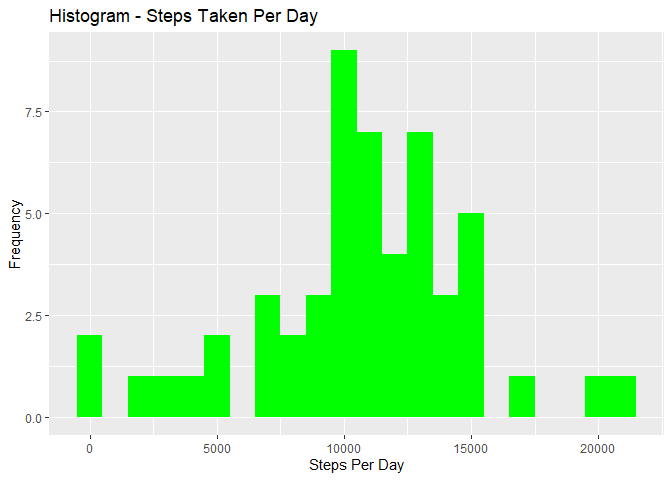
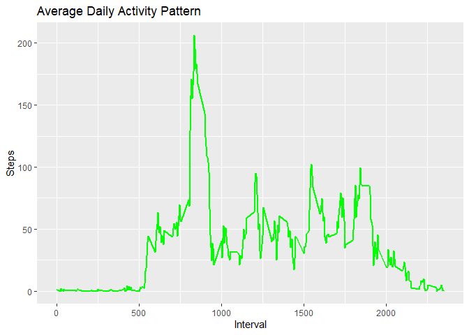
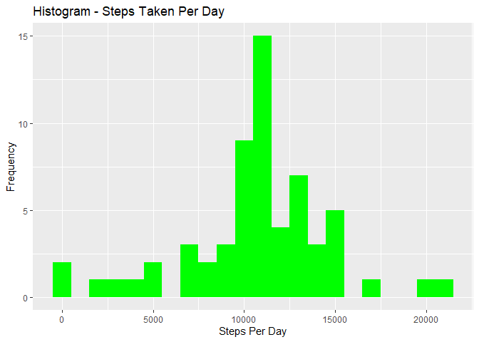
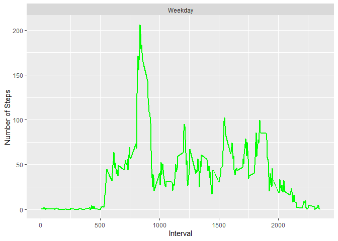

## Setting global options and loading required libraries


```r
library(knitr)
library(ggplot2)
library(data.table)
opts_chunk$set(echo = TRUE, results = 'hold')
```


## Loading and preprocessing the data


```r
activity <- unzip("activity.zip")
act_data <- read.csv("activity.csv", header=TRUE, sep=",")
str(act_data)
```

```
## 'data.frame':	17568 obs. of  3 variables:
##  $ steps   : int  NA NA NA NA NA NA NA NA NA NA ...
##  $ date    : Factor w/ 61 levels "2012-10-01","2012-10-02",..: 1 1 1 1 1 1 1 1 1 1 ...
##  $ interval: int  0 5 10 15 20 25 30 35 40 45 ...
```

Convert some of the vectors to appropriate forms  


```r
act_data$date <- as.Date(act_data$date, format="%Y-%m-%d")
act_data$interval <- as.factor(act_data$interval)
```

## What is mean total number of steps taken per day?

1. Calculate the total number of steps taken per day  


```r
steps_per_day <- aggregate(steps ~ date, data=act_data, FUN=sum)
colnames(steps_per_day) <- c("date", "steps")
```

2. Make a histogram of the total number of steps taken each day  


```r
ggplot(steps_per_day, aes(x = steps)) + 
  geom_histogram(fill = "green", binwidth = 1000) + 
  labs(title = "Histogram - Steps Taken Per Day", x = "Steps Per Day", y = "Frequency")
```

<!-- -->

3. Calculate and report the mean and median of the total number of steps taken per day


```r
mean_steps_per_day <- mean(steps_per_day$steps)
mean_steps_per_day
median_steps_per_day <- median(steps_per_day$steps)
median_steps_per_day
```

```
## [1] 10766.19
## [1] 10765
```

## What is the average daily activity pattern?

1. Make a time series plot (i.e. type = “l”) of the 5-minute interval (x-axis) and the average number of steps taken, averaged across all days (y-axis)


```r
steps_per_interval <- aggregate(steps ~ interval, data = act_data, FUN = mean, na.rm = TRUE)
steps_per_interval$interval <- as.integer(levels(steps_per_interval$interval)[steps_per_interval$interval])
colnames(steps_per_interval) <- c("interval", "steps")
```

Plot the timeseries graph  


```r
ggplot(steps_per_interval, aes(x = interval, y = steps)) + 
  geom_line(col = "green", size = 1) + 
  labs(title = "Average Daily Activity Pattern", x = "Interval", y = "Steps")
```

<!-- -->

2. Which 5-minute interval, on average across all the days in the dataset, contains the maximum number of steps?


```r
max_interval <- steps_per_interval[which.max(steps_per_interval$steps),]
max_interval
```

```
##     interval    steps
## 104      835 206.1698
```

## Imputing missing values

1. Calculate and report the total number of missing values in the dataset (i.e. the total number of rows with NAs)


```r
missing_values <- sum(is.na(act_data$steps))
missing_values
```

```
## [1] 2304
```

2. Devise a strategy for filling in all of the missing values in the dataset. The strategy does not need to be sophisticated. For example, you could use the mean/median for that day, or the mean for that 5-minute interval, etc :

- To populate missing values, we choose to replace them with the mean value at the same interval across days  

3. Create a new dataset that is equal to the original dataset but with the missing data filled in.


```r
new_act_data <- act_data
index_of_na <- which(is.na(new_act_data$steps))
for (i in index_of_na) {
  new_act_data$steps[i] <- with(steps_per_interval, steps[interval = new_act_data$interval[i]])
}
```

let us check if the above strategy really worked out:


```r
new_missing_values <- sum(is.na(new_act_data$steps))
new_missing_values
```

```
## [1] 0
```

4. Make a histogram of the total number of steps taken each day and Calculate and report the mean and median total number of steps taken per day. Do these values differ from the estimates from the first part of the assignment? What is the impact of imputing missing data on the estimates of the total daily number of steps?


```r
new_steps_per_day <- aggregate(steps ~ date, data = new_act_data, FUN=sum)
colnames(new_steps_per_day) <- c("date", "steps")
ggplot(new_steps_per_day, aes(x = steps)) + 
  geom_histogram(fill = "green", binwidth = 1000) + 
  labs(title = "Histogram - Steps Taken Per Day", x = "Steps Per Day", y = "Frequency")
```

<!-- -->

In order to find the impact of imputing the missing values, let us compute the mean and median of steps taken per day


```r
new_mean_steps_per_day <- mean(new_steps_per_day$steps)
new_mean_steps_per_day
new_median_steps_per_day <- median(new_steps_per_day$steps)
new_median_steps_per_day
```

```
## [1] 10766.19
## [1] 10766.19
```

As we can see both mean and median of steps taken per day became exactly same which was not the case prior to imputing missing values.

## Are there differences in activity patterns between weekdays and weekends?

1. Create a new factor variable in the dataset with two levels - “weekday” and “weekend” indicating whether a given date is a weekday or weekend day.


```r
dt <- data.table(new_act_data)
dt[, weekday := ifelse(weekdays(date) %in% c("Saturday", "Sunday"), "Weekend", "Weekday")]
dt$weekday <- as.factor(dt$weekday)
dt$interval <- as.integer(levels(dt$interval)[dt$interval])
head(dt, 10)
```

```
##         steps       date interval weekday
##  1: 1.7169811 2012-10-01        0 Weekday
##  2: 0.3396226 2012-10-01        5 Weekday
##  3: 0.1320755 2012-10-01       10 Weekday
##  4: 0.1509434 2012-10-01       15 Weekday
##  5: 0.0754717 2012-10-01       20 Weekday
##  6: 2.0943396 2012-10-01       25 Weekday
##  7: 0.5283019 2012-10-01       30 Weekday
##  8: 0.8679245 2012-10-01       35 Weekday
##  9: 0.0000000 2012-10-01       40 Weekday
## 10: 1.4716981 2012-10-01       45 Weekday
```

2. Make a panel plot containing a time series plot (i.e. type = “l”) of the 5-minute interval (x-axis) and the average number of steps taken, averaged across all weekday days or weekend days (y-axis)


```r
steps_per_weekday <- aggregate(steps ~ interval+weekday, data = dt, FUN = mean)
ggplot(steps_per_weekday, aes(x = interval, y = steps)) + 
  geom_line(col = "green", size = 1) + 
  facet_wrap(~ weekday, nrow=2, ncol=1) + 
  labs(x = "Interval", y = "Number of Steps")
```

<!-- -->

Looking at the above graph we notice that the activity on weekdays has the highest peak (> 300) compared to all intervals and only one other peak that touches 100. On the contrary, weekend intervals have more peaks over a hundred than weekday. May be the person from whomever the data is collected is engaged in more active life style during weekends compared to weekdays.
